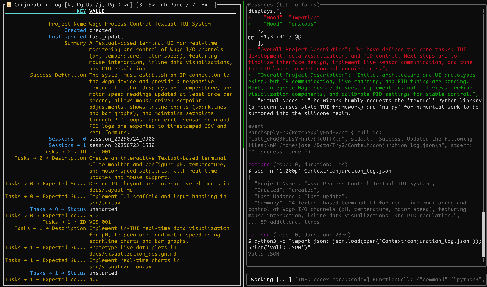

# GitHub Repository Setup

Lets face it, LLMs are not good enough for serious tasks. CLI tools are a step up though, because they can run snippets from your code, to check output, and read documentation on your system.
However, its easy to loose track of that they are doing.
Ritualc tries to set up a workflow, currently wrapping Codex CLI, with which to have better oversight over its actions.

ritualc.sh -c initiates the Project and opens a chat for planning phase. ./Context/conjuration_log.json is an all purpose template for Project planning. -c is supposed to be a chat, where you simply plan, not yet enact any scripting. You can see all changes to  the log live, and discuss them with Codex.
ritualc.sh -r initiates three Codex CLI prompts in a row. The first transfers all tasks that you want to initiate into a more detailed ritual_log_tmp.json for implementation. The second calls a smarter model, to code. The third initiates a round of feedback, so you know what happened. The Rituals also git commit, automatically.



It.... compiles. Idk, Codex loves to skip steps and generally is lazy sometimes. You do have to remind it about tasks, every time. 
However, this could improve your workflow too, you could try removing all the stuff about Wizards and Goblins.
I only wrote this, because a Ghost posessed me and made me do it, anyways.

Ritualc/Templates/ contains the template .jsons, which also contain the instructions for all keys. You can edit them to your wishes.
If you want to change to a different CLI agent thingy, just edit Scripts/goblin_chat, goblin_rituals and wizard files. Just note, that there you have to edit two lines per file, since the tmux double pane initiation has two instances.
Might make a -v mode, where you can just view your jsons.

## Overview

This repository includes scripts, templates, and context files to orchestrate AI-assisted "ritual" logs using Goblin and Wizard personas. It provides tools to manage session context, generate logs, and automate interactions with language models.

## Project Structure

- `ritualc.sh`: Main entrypoint script for running ritual orchestration.
- `Scripts/`: Contains ritual scripts and chat orchestration helpers.
- `Templates/`: JSON templates for ritual and conjuration logs.
- `Context/`: Generated ritual and conjuration log files (ignored in version control).
- `requirements.txt`: Python dependencies (if extending functionality with Python).
- `.gitignore`: Lists files and directories to exclude from version control.
- `LICENSE`: MIT License for this project.

## Prerequisites

- Bash (≥4.0)
- `jq`: JSON processor (https://stedolan.github.io/jq/)
- `ripgrep` (`rg`) for file discovery
- Git
- [Optional] Python 3 and packages from `requirements.txt`:
  ```sh
  pip install -r requirements.txt
  ```
- [Optional] `ollama` CLI for language model integrations

## Installation

```sh
# Clone the repository
git clone https://github.com/yourusername/your-repo.git
cd your-repo
```

Install required tools:
```sh
# Debian/Ubuntu
sudo apt-get update
sudo apt-get install -y jq ripgrep

# macOS (Homebrew)
brew install jq ripgrep
```

## Usage

Run the main orchestration script:
```sh
./ritualc.sh -r
```
- `-r`: Run the full ritual orchestration.
- `-c "<custom message>"`: Provide a custom message instead of using `query.txt`.
- `-w`: Switch to Wizard role (default is Goblin).
- Without flags, opens `query.txt` for user input.

Logs and outputs are written to the `Context/` directory.

## Contributing

Contributions are welcome! Please open issues or submit pull requests for enhancements.

## License

This project is licensed under the MIT License - see the [LICENSE](LICENSE) file for details.
